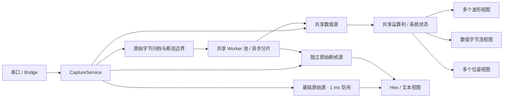

# 项目结构与数据流

前端使用按顺序加载的经典脚本，模块统一挂在 `SerialPlotter` 下；同一模块也可通过 CommonJS 用于 Node 测试。直接打开 `index.html` 即可运行，无需构建。

## 页面分工

- 左侧：通讯、控件库、导出数据。连接、暂停、清空、容量和原始帧分段上限属于全局；导出独立选择缓冲区来源。
- 中央：可滚动的多控件工作区，下方为全局定位与搜索、常驻展开的全局发送区。
- 右侧：当前选中控件的标题、帧解析、显示方式及适用的通道配置。空白点击取消选择。左侧“导出数据”独立选择缓冲区来源。

## 主要模块

| 模块 | 职责 |
| --- | --- |
| `app.js` | 装配服务与控件，通讯连接，全局操作、统计、配置及独立缓冲区导出绑定 |
| `captureService.js` | 统一接收入口、原始归档、共享数据源、暂停、清空、局部重建和共享任务池 |
| `sampleRate.js` | 按接收块单调到达时刻与有效数值帧计数估计共享采样率，过滤短时抖动并隔离暂停间隔 |
| `captureHistory.js` | 按原始字节位置保存输入块和断流检查点，异步重放及增量追赶 |
| `dataParser.js` / `numericCodec.js` | 数值帧重同步、校验与解码 |
| `rawFrameParser.js` | 空闲/换行断帧、跨块分隔符、超长帧完整分段 |
| `frameBuffer.js` | 按需分配的有界数值与原始帧缓存，时间、字节位置和分段元数据 |
| `channelOperations.js` | 安全表达式解析、依赖检查、逐样本四则/差分/积分/卷积、可复用系统及独立初始状态 |
| `computedFrames.js` | 共享数值读取视图及派生列存储，历史保留、异步局部重建与实时追赶 |
| `channelConfigView.js` | 波形与数值字节流共用通道编辑器，新增通道拖动排序、独立可见性、全局名称/颜色/定义及内联错误 |
| `systemResponse.js` / `systemResponseFrames.js` | 零状态单位脉冲响应、线性系统传递函数、幅相与 dB 换算、独立静态缓存及只读绘图数据视图 |
| `historyWorkers.js` / `textHistory.js` | 共用后台任务调度、数值解码、Hex 拼装及字符统计 |
| `widgetWorkspace.js` | 多控件位置、栅格步进、碰撞、双向滚动、局部缩放、拖入预览、键盘操作及销毁 |
| `monitorWorkspace.js` | 旧布局兼容及可复用的纯几何约束 |
| `widgetController.js` | 控件类型注册、工厂、稳定编号、实例生命周期、右侧属性绑定 |
| `widgetConfig.js` | 版本化配置、默认值、旧双监视台迁移、完整校验 |
| `widgetViewport.js` | 独立视口的可移植保存、校验及来源就绪后的延迟恢复 |
| `poseMath.js` / `poseConfig.js` / `poseData.js` | 旋转约定与正交化、独立实例配置、同帧标量绑定和原始位置读取 |
| `poseRenderer.js` / `poseView.js` / `poseConfigView.js` | 立方体与双坐标轴正交投影、相机/历史/30 FPS 调度、位姿属性面板 |
| `plotter.js` / `spectrum.js` / `plotMath.js` | 只读波形视图、FFT/窗归一化、像素分桶、坐标轴、缩放与标记 |
| `monitorView.js` / `monitorDisplay.js` / `numberMonitor.js` | 可见记录虚拟渲染、文本映射、Hex 对照、数值对齐、复制和高亮 |
| `monitorDisplayView.js` | 字节流实例的显示属性，与统一通道编辑器协作 |
| `workspaceTools.js` / `monitorSearch.js` / `frameNavigation.js` | 当前激活控件的定位、异步搜索及原始字节区间跨视图映射 |
| `exportSettingsView.js` / `csvExport.js` / `captureExport.js` | 数据来源与格式独立的导出选项、通道选择及分块文件写入 |
| `exportParsing.js` / `textEncoder.js` | 导出副本的流式数值/文本断帧、独立运算状态、分批字符编码与严格输出校验 |
| `serialEngine.js` / `netEngine.js` / `sendController.js` | 通讯、连接收尾、全局发送和定时发送生命周期 |
| `configValidation.js` / `configView.js` / `configStore.js` | 兼容旧配置字段及通用校验和保存工具 |
| `bridge.js` / `bridgeSession.js` | 本地 WebSocket 至 TCP/UDP 的二进制数据转发 |

## 采集与共享

服务归档一次输入，数值帧只解析和写入一次。波形视图以 `viewOnly` 方式读取共享 FrameBuffer，不追加、裁剪或删除共享数据。有效断帧规则及历史起点相同的字节流复用数据源；文本显示缓存按数据源和字符集复用。空工作区仍保留共享数值源及基础原始源。

位姿直接引用共享数值源及运算列，所有旋转分量来自同一保留帧。实例只保存映射、旋转约定、叠加、显示基底、相机和历史目标 order；相机与配置独立，不保存跨会话的历史位置。源 generation/服务 epoch 变更或清空会撤销旧姿态。导入先用候选通道运算引擎校验全部隐藏绑定，删除/重排按通道编号映射保持信号身份。

`PoseMath` 统一使用右手主动旋转、列向量与按行存储矩阵；四元数缩放后单位化，矩阵使用极分解迭代正交化，拒绝反射/退化。`PoseRenderer` 按面朝向与深度绘制立方体，遮挡的轴段使用虚线；显示左右手基底不参与输入 SO(3) 校验。`PoseView` 合并数据通知，只读取当前目标帧，按工作区比例与 DPI 重新栅格化，静止/不可见时不继续排任务，销毁解绑事件与观察器。

每个解析源分别保留最新 N 帧，TX 使用独立的全局 N 帧缓存。原始归档按所有数据源的最早保留位置和未完成解析位置裁剪。原始帧达到字节上限时分段，保留原始顺序、分隔符状态与连续字符解码，不将人工分段视为断流。

字节流视图借用完整 TX 和错误记录，按接收顺序合并索引，只物化可见行，不为每个实例复制历史。文本导出在真实断流处结束对应方向的解码，人工分段仍连续。

## 设置与生命周期

数值帧规则、文本字符集/断帧方式和通道名称属于全局。每个波形分别保存显示模式、Y 轴范围、FFT、视口和可见性；字节流分别保存采集显示模式与排版、筛选、高亮等显示规则。右侧文本帧规则修改同步所有字节流设置，只重建或清理受影响文本数据源；Hex 始终固定按 1 ms 空闲断帧。激活变化更新定位搜索及尚未手动修改的导出帧参数，导出记录范围仍独立选择。

删除实例停止绘图、取消显示准备、解绑事件并断开观察器；共享缓存只减少引用。没有引用的独立源可释放，基础源与数值源继续运行。后台线程池由采集服务拥有，实例取消不销毁线程池。

共享历史重建开关开启时，只重建受影响数据源；关闭时，只让该源从当前接收位置重新开始。数值规则更新影响所有数值视图。每个重建使用自己的 generation 和服务 epoch 检查，工作快照完成后增量追赶输入及新增断流边界；旧任务不能在清空或销毁后回写。线程池最多使用逻辑处理器数减二；不足三个时异步主线程分片。

## 公共工具

定位和搜索通过 `getActiveWidget` 获取当前激活控件作为来源，不再保存独立的来源选项；就近参考控件仍独立保存。激活变化会取消旧异步搜索、清除结果和定位提示、更新搜索字段与默认时间；没有激活控件时禁止操作。相对时间零点为当前来源按接收顺序保留的第一帧。搜索结果包含会话、来源、原始字节区间和适用通道，各控件分别映射；没有保留目标或存在解析间隙时跳过并提示，不能制造边界命中。

波形搜索时域原值经该实例变换后的数值；字节流数值搜索原始解码值。首次方向和循环逻辑与旧版一致。长记录依据实际换行的字节映射居中定位。参考控件选择不随控件激活而变化。

位姿搜索类型为 number，候选为输入绑定及已启用的通道叠加绑定；同步跳转按完整保留帧的原始字节区间定位并显示命中状态。恢复捕获会取消旧搜索和视口恢复任务、清除标记，所有控件回到最新跟随。

定位与搜索在保留范围内居中，首尾不足半窗时按有效边界对齐。波形的 `_timeViewportRange` 统一提供实际绘制、暂停 FFT 与频率视口恢复所用的样本范围，避免单独计算中心产生负索引、超出末帧或截短 FFT 输入。字节记录不再插入首尾居中填充，虚拟布局也按第一条和最后一条记录约束位置。

导出位于左侧，先选择 bin/hex/txt/csv 格式，记录范围独立于当前激活控件。CSV 默认读取共用数值缓冲区，也可按导出副本的独立帧规则流式解析其他保留记录。默认帧参数跟随当前监视台共享配置，手动修改不触碰采集和历史，可恢复跟随。文本解码字符集与输出文件编码独立，遗留编码映射按需异步准备。副本按原始字节位置处理断流/缺口，并分批解析、运算、编码和写入，避免复制整个历史或丢弃超出容量的重解析帧。

同一数据源的控件别名合并，提示关联控件；删除一个关联实例但数据源仍被使用时保持选择与配置。原始格式可合并本源 RX 与共用成功发送的 TX；仅导出 TX 时不依赖 RX 来源。FrameBuffer 增量维护保留字节总数，摘要读取该计数及首尾时间，无需遍历全部历史。读取和写入检查实际来源、格式、会话、生成版本及保留窗口，来源失效时中止。导出开始后使用帧参数快照，激活无关控件不改变导出结果。大数据使用文件系统接口分块写入。

## 配置与验证

`serialplot_v3_config` 保存 version 2 的全局设置、控件清单、实例设置、布局及工具来源，沿用旧本地存储键。旧平铺配置迁移为一个波形与一个字节流；首次用户与明确保存的空工作区均保持空白。运行时原始字节位置不跨会话保存。导入先完整校验，失败不替换当前配置。

当前导出格式保存在 `tools.exportFormat`，原始格式和 CSV 的上次范围分别保存在 `tools.exportRecordSourceId` 与 `tools.exportCsvSourceId`，当前有效来源仍保存在 `tools.exportSourceId`。`tools.exportProfiles` 保存各来源与格式的输出编码、断帧方式、独立数值规则及跟随状态。旧导出字段校验后迁移；旧实例文本规则统一迁移到 `global.textEncoding` / `global.textBoundary`，无效导入不改动现状。

波形的用户缩放、平移及复位触发保存；持续采集不逐帧写入本地存储。采样波形窗口、FFT 默认输入范围和系统幅相频率网格共用 `global.plotWindowPoints`；系统响应时域独立保存 `settings.plotResponseTimePoints`。SystemResponseFrames 分别接收时域长度与频率网格点数，避免独立时域修改改变 Bode 横轴。实际缩放视口独立保存，来源就绪且存在采样后恢复。

工作区在 `workspace.zoom` 保存 0.25～5 的界面缩放比例，以整数百分比归一化。工具栏允许输入；滚轮及快捷键跨过全部控件包围框外扩 10px 的适配比例时吸附，比例向下取整。适配使用运行时 origin 保证逻辑零点也有留白，输入坐标扣除 origin；origin 不改变保存布局。空白框选及 Ctrl＋A 保存会话内 selectedIds，组移动使用共同栅格位移并检查全部外部控件，Esc 原子恢复。右键空白交替以点击位置居中恢复 100% 与完整适配；靠近原点时将滚动限制为非负。双击标题调用 fitWidget，以该实例包围框适配工作区，不修改逻辑布局。运行时 focusState 记录聚焦前的比例、滚动位置、origin 和 centerPoint；再次双击同一标题恢复此快照，按当前滚动范围限制位置，切换标题则记录新的前一画面。右键空白、完整适配、恢复布局、导入布局及删除聚焦实例会清除快照；快照不保存到配置。运行时 centerPoint 保留正方向所需的滚动余量，后续测量不会将居中位置弹回边界。控件右键事件独立。外层按视觉尺寸提供滚动范围，内层 CSS zoom 重新排版文字；波形位图按工作区比例乘屏幕密度分配，暂停时也重绘，保持清晰。

Delete 删除当前激活实例，标题关闭与属性面板删除也统一调用 WidgetController.requestRemove。原生 dialog 提供非阻塞二次确认，默认聚焦取消按钮；确认期间采集继续。待删除编号固定，取消或销毁立即清理，旧 close 事件不能清除新请求。程序化 remove 和配置替换沿用直接销毁路径，实例关闭监听在移除时解绑。输入控件、可编辑区域、输入法合成与对话框内的键盘事件不触发工作区删除或全选。

测试使用 Node 内置测试运行器：`npm test`。`npm run check` 检查经典脚本语法、缩进、行尾及文件末尾换行。浏览器验证继续以 `file://` 直接加载，检查多实例、宽窄布局、交互和持续采集。
